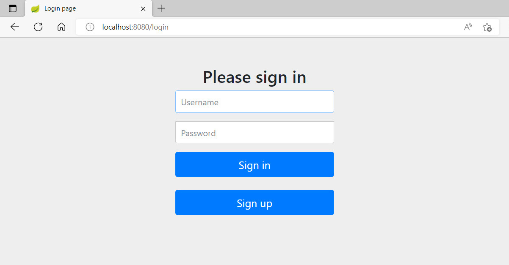

## spring-security-app

### Web application demonstrating the possibilities of authentication and authorization of Spring Security Technology

***Description:***

This example shows how Spring Security intercepts all user requests and transfers them to the authentication page. 
By default, all newly registered users are assigned the ROLE_USER. 
Only the pre-installed website Administrator has ROLE_ADMIN and can access a particular page 
that ordinary users cannot access.

***How to use:***

Create a new local "database" schema (I used MySQL), 
and add your username and password to the application.properties file.  
Create the "SecurityApplication" class run configuration in your IDE and start the Spring Security Application. 
Link to resource: 
http://localhost:8080  
You will be taken to the authentication page. 
Register a new user or use the preset credentials:  
Username: user  
Password: test  
or  
Username: admin  
Password: test  
Admin has access to a particular webpage:
http://localhost:8080/admin

***Tools used:***

Java  
Maven  
Spring Boot  
Spring Security  
Thymeleaf  
MySQL  
FlyWay  
